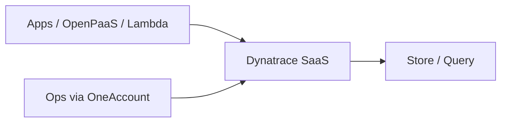

# Architecture Diagram Drawing Tools

## Decision tree

```
Need to draw architecture?
  Formal ARB / HLD for board (like AXA Japan)?
    Company already uses Visio / Lucid / Miro?
      YES → use that (export PNG/SVG into PPT)
      NO  → diagrams.net (draw.io) or Lucidchart
  Quick AS-IS / TO-BE context boxes?
    diagrams.net  OR  Excalidraw  OR  PowerPoint shapes
  Cloud AWS/Azure/GCP icon map?
    Cloudcraft / IcePanel / diagrams.net cloud libraries
  Diagram must live in Git as text?
    Mermaid  OR  PlantUML  OR  Structurizr (C4)
  Whiteboard workshop with many people?
    Miro  OR  FigJam  OR  Microsoft Whiteboard
  C4 model (Context/Container/Component)?
    Structurizr  OR  IcePanel  OR  Mermaid C4
```

---

## Short takeaway

| Key point | Detail |
| --- | --- |
| Best free start | **diagrams.net** (draw.io) — browser or desktop, export to PNG/SVG/PPT-friendly |
| Best for ARB slides | Draw in diagrams.net / Visio / Lucid → paste into PowerPoint |
| Best for GitOps docs | **Mermaid** or **PlantUML** (text → diagram in Markdown) |
| Best for workshops | **Miro** or **FigJam** |
| Best for C4 architecture | **Structurizr** or **IcePanel** |
| For your Splunk→Dynatrace case | diagrams.net for AS-IS/TO-BE + HLD; export PNG into the ARB PPT |

---

## Summary

Yes. There are many tools. For architecture work you usually pick by **purpose**: board-ready pictures, cloud icon maps, text-in-Git diagrams, or live workshops. For an AXA-style ARB pack, most teams draw the Solution Context / HLD in **diagrams.net**, **Visio**, or **Lucidchart**, then paste PNGs into PowerPoint. Keep Mermaid/PlantUML for README and runbook docs that must version with code.

---

## Main content

### What this is (beginner)

An **architecture diagram** is a picture of how systems connect: apps, networks, SaaS (like Dynatrace), data stores, and who uses what.

A **drawing tool** is software that helps you make that picture. Some are drag-and-drop (like PowerPoint shapes). Some are text (you type code, it draws boxes). Some are whiteboards for groups.

You do **not** need one tool for everything. Many teams use:

1. diagrams.net for the formal AS-IS / TO-BE / HLD  
2. PowerPoint for the ARB narrative slides  
3. Mermaid in Git for day-to-day docs  

### Tool map by job

| Job | Good tools | Why you care |
| --- | --- | --- |
| Free, fast, ARB-quality boxes | diagrams.net (draw.io) | No license fight; AWS/Azure/GCP icon packs; export PNG/SVG |
| Company standard (Microsoft shops) | Visio, PowerPoint, Whiteboard | Already on M365; managers expect `.vsdx` / PPT |
| Polished collaboration | Lucidchart, Miro, FigJam | Multiplayer edit; good for reviews |
| Sketch / whiteboard feel | Excalidraw, tldraw | Fast drafts; less “corporate polish” |
| Text-as-code in Git | Mermaid, PlantUML, D2 | Diffs in PRs; never lose the source |
| C4 model (Context→Container→Component) | Structurizr, IcePanel, Mermaid C4 | Keeps levels consistent |
| Pretty AWS 3D maps | Cloudcraft, Iconify+diagrams.net | Stakeholder “wow” cloud pictures |
| Sequence / API calls | Mermaid sequence, PlantUML, Lucid | Better than boxes for request flows |

---

### Web apps (browser)

| Tool | Cost vibe | Best for | Link |
| --- | --- | --- | --- |
| **diagrams.net** | Free | General architecture, HLD, AS-IS/TO-BE | https://app.diagrams.net |
| **Excalidraw** | Free / paid collab | Hand-drawn style sketches | https://excalidraw.com |
| **Lucidchart** | Paid (trial) | Formal diagrams + Confluence/Notion embed | https://www.lucidchart.com |
| **Miro** | Freemium / paid | Workshops, sticky notes + diagrams | https://miro.com |
| **FigJam** (Figma) | Freemium / paid | Workshop boards; design teams | https://www.figma.com/figjam/ |
| **Whimsical** | Freemium / paid | Clean flowcharts + mind maps | https://whimsical.com |
| **IcePanel** | Paid | C4 landscape for product/platform | https://icepanel.io |
| **Cloudcraft** | Paid | AWS isometric architecture | https://www.cloudcraft.co |
| **Eraser.io** | Freemium | Docs + diagrams together | https://www.eraser.io |
| **tldraw** | Free / SDK | Infinite canvas sketch | https://www.tldraw.com |

### Desktop / office apps

| Tool | Best for | Note |
| --- | --- | --- |
| **Microsoft Visio** | Corporate HLD, network diagrams | Common in enterprises; check if AXA/your tenant licenses it |
| **Microsoft PowerPoint** | Final ARB deck | Fine for simple boxes; weak for large HLDs |
| **draw.io Desktop** | Offline diagrams.net | https://github.com/jgraph/drawio-desktop |
| **OmniGraffle** (Mac) | Polished Mac diagrams | Paid |
| **Inkscape / Illustrator** | Pixel-perfect posters | Overkill for most SRE diagrams |

### Text-as-code (great with Git)

| Tool | What you write | Where it renders |
| --- | --- | --- |
| **Mermaid** | `flowchart` / `sequenceDiagram` / C4 | GitHub, GitLab, many Markdown previews, Notion plugins |
| **PlantUML** | `@startuml` syntax | CI, Confluence plugins, local JAR |
| **D2** | Declarative diagram language | https://d2lang.com |
| **Structurizr DSL** | C4 model as code | Structurizr Lite / cloud |
| **Graphviz (dot)** | Classic graph language | Pipelines, auto layouts |

Example Mermaid (you can paste into GitHub Markdown):



---

### What to use for your current work

| Your artifact | Recommended tool | Export into |
| --- | --- | --- |
| ARB Solution Context AS-IS / TO-BE | diagrams.net | PNG into PowerPoint |
| Technical HLD with ActiveGate / VPC | diagrams.net or Visio | PNG / SVG into PPT |
| Data Architecture (Ingestion→Store→Query) | diagrams.net or Mermaid | PPT or Markdown |
| Security OneAccount flow | diagrams.net or Mermaid sequence | PPT |
| PagerDuty Event Orchestration flow | Mermaid or Excalidraw | Daily Files md / PPT |
| Workshop with many reviewers | Miro / FigJam | Screenshot into PPT |

### Practical beginner workflow (ARB)

```
1. Sketch boxes on paper or Excalidraw (5–10 min)
2. Redraw cleanly in diagrams.net
   - use AWS / Azure / GCP / generic icon libraries
   - one page AS-IS, one page TO-BE, one page HLD
3. Export PNG (high resolution) or SVG
4. Insert into PowerPoint ARB slides
5. Keep the .drawio file next to the PPT (source of truth for edits)
```

### Choice cheat sheet

| If you… | Pick |
| --- | --- |
| Want free and good enough today | **diagrams.net** |
| Must match Microsoft enterprise process | **Visio** (+ PowerPoint) |
| Need multiplayer review this week | **Lucidchart** or **Miro** |
| Want diagrams versioned with Terraform/docs | **Mermaid** or **PlantUML** |
| Doing full C4 for a platform | **Structurizr** or **IcePanel** |
| Selling an AWS landing-zone picture | **Cloudcraft** or diagrams.net AWS pack |

### Common mistakes

| Mistake | Better approach |
| --- | --- |
| Drawing the whole HLD only in PowerPoint | Use diagrams.net; PPT is for story + pasted pictures |
| One giant unreadable diagram | Split: Context (TO-BE) → HLD → Data → Security |
| No source file, only PNG | Keep `.drawio` / Mermaid / Visio source in the project folder |
| Mixing logical and network detail on one slide | Separate “business context” from “ports/ActiveGate/VPC” |
| Using a personal free SaaS for confidential AXA diagrams | Check company policy; prefer approved M365 / Visio / private diagrams.net |

### Security / company policy note

For AXA or any regulated org: before uploading architecture to a public SaaS (free Excalidraw room, public Miro), confirm **approved tooling**. Prefer:

- Company Microsoft 365 (Visio, Whiteboard, PowerPoint)
- Self-hosted or desktop diagrams.net
- Private Lucid/Miro tenant if the company already bought it

---

## Data flow map

```
Need a diagram
   |
   +-- board / ARB PPT --------> diagrams.net / Visio / Lucid --> PNG --> PowerPoint
   |
   +-- Git docs / runbooks ----> Mermaid / PlantUML / D2 --> Markdown preview
   |
   +-- workshop ---------------> Miro / FigJam / Whiteboard --> screenshot
   |
   +-- C4 platform model ------> Structurizr / IcePanel --> export views
   |
   +-- AWS pretty map ---------> Cloudcraft / diagrams.net AWS icons
```

---

## Related files

| File | Purpose |
| --- | --- |
| [12.sh](./12.sh) | Open tool URLs (browser bookmarks) |
| [12-architecture-diagram-drawing-tools-follow.txt](./12-architecture-diagram-drawing-tools-follow.txt) | Chat-ready copy |
| Your ARB PPT | Daily Files `2026-08-31/11-axa-arb-splunk-dynatrace-ppt/` |
| ARB fact capture | Daily Files `2026-08-31/10-axa-arb-splunk-dynatrace-migration/` |
| Adocs twin | `/Users/k/Codes/Pra/P1GithubActions/P1Gactions/app/Adocs/2026-08-31/12-architecture-diagram-drawing-tools/` |

---

## Commands

Browser bookmarks only. See [12.sh](./12.sh). Review and run yourself.

```bash
open "https://app.diagrams.net"
open "https://excalidraw.com"
open "https://mermaid.live"
```
